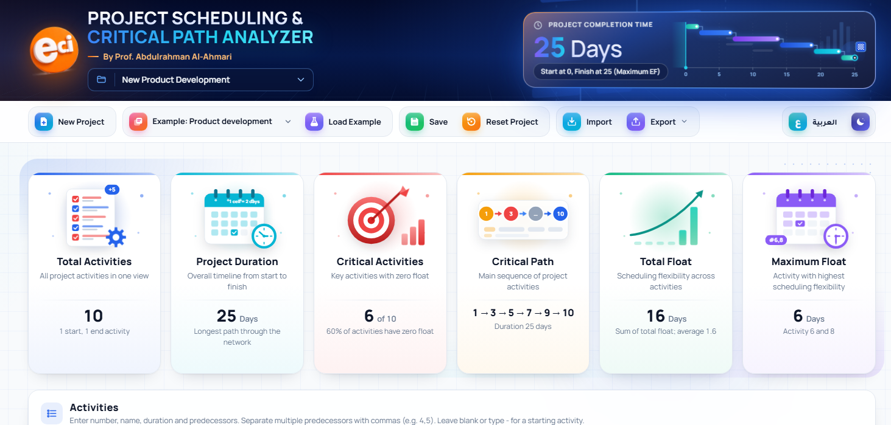
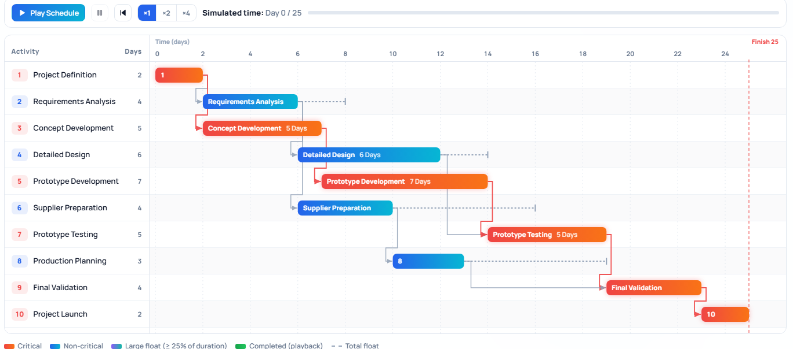
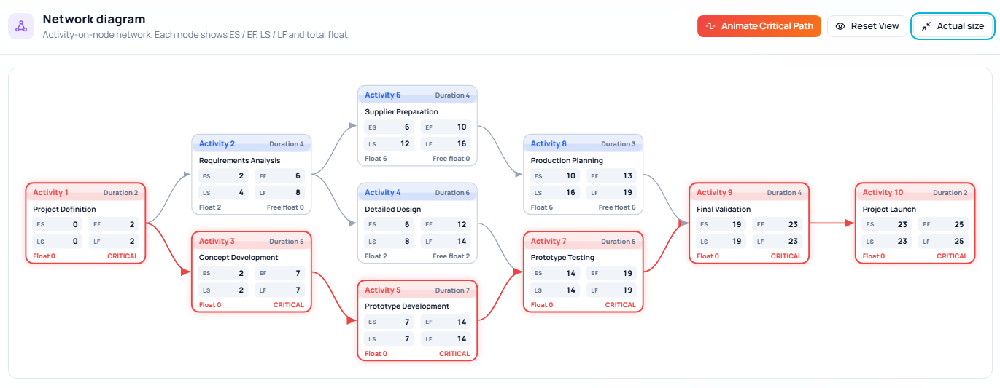

# Project Scheduling & Control

**By Prof. Abdulrahman Al-Ahmari, ECI Lab**

An interactive, bilingual (English / Arabic) web tool for learning and applying the **Critical Path Method (CPM)**. Enter activities, durations and predecessors; the tool calculates the full schedule, finds every critical path and explains the result.

**Live demo:** https://ecilab.github.io/cpm-analyzer/

## Features

- **CPM calculation:** forward and backward passes in topological order, ES, EF, LS, LF, total float and free float.
- **All critical paths:** every zero-float path from start to finish is found and listed, not just one.
- **Input validation:** duplicate numbers, missing names, negative durations, unknown predecessors, self-dependencies and circular dependencies (reported as the exact cycle, e.g. 3 → 5 → 7 → 3).
- **Animated Gantt chart:** dependency arrows, float tails, a step-by-step critical-path trace, schedule playback at ×1/×2/×4, zoom and PNG export.
- **Network diagram:** activity-on-node layout with an animated run along the critical path.
- **Schedule analysis:** statements and risk indicators generated only from the calculated values.
- **Relationship types with lags:** finish-to-start, start-to-start, finish-to-finish and start-to-finish, with lags and leads (for example `4SS+2`, `3FF`, `5FS-1`), as in MS Project and Primavera.
- **Calendar dates:** a project start date, a weekend pattern (including Friday–Saturday) and holidays, so the Gantt chart, CPM table and exports show real dates.
- **AOA diagram:** the activity-on-arrow network with the minimum dummy activities and early/late event times, next to the activity-on-node diagram.
- **Advanced analysis tabs:**
  - **PERT:** optimistic, most likely and pessimistic times, expected times, critical-path variance, P(T ≤ target) and the duration for a required probability, with the working shown.
  - **Monte Carlo:** thousands of seeded runs, completion-time histogram and S-curve, P50/P80/P90 and the criticality index of every activity.
  - **Crashing:** step-by-step time–cost trade-off using the cheapest cut through all critical paths, with direct, indirect and total cost curves and the optimum duration.
  - **Resources:** resource histogram for early and late start, levelling within float, and scheduling within a resource limit.
  - **Earned value:** baseline, % complete and actual cost, PV, EV, AC, SV, CV, SPI, CPI, EAC, earned schedule and the S-curve.
  - **Scenarios:** save what-if versions and compare duration, cost, probability and resource peak side by side.
- **Step-by-step solution:** every value written with its numbers, as on the board (`ES₇ = max(EF₄, EF₅) = max(12, 14) = 14`), played step by step on the network and exported as a printable answer sheet.
- **Student practice mode:** hides the answers; students fill in ES, EF, LS, LF, float and the critical activities. Each wrong value is traced to the misconception behind it (for example *used the smallest EF instead of the largest*, *confused total float with free float*, *forgot the other successors*).
- **Seven example projects:** 10, 11, 20 and 40 activities, a PERT/cost/resource example, a lag example and a validation demo containing a cycle. Every example includes PERT estimates, costs and crash data, resources, a calendar, progress with a baseline, and two scenarios, so all the tools work on it straight away.
- **Import / export:** CSV and JSON, Excel (.xlsx) with live CPM formulas, MS Project XML, a printable report, and a light/dark theme.
- **Arabic interface** with right-to-left layout.
- **Optional AI assistant:** off by default. With your own Claude (Anthropic) or OpenAI API key, it explains the schedule in plain language and answers questions about it; in Practice mode it gives hints only and is never given the correct values.

## Quick start

Open `index.html` in any modern browser. Nothing needs to be installed and no internet connection is required, except to load the web fonts.

1. Click one of the example cards above the activity table, or type your own activities.
2. Separate multiple predecessors with commas (`4,5`). Leave the field empty or type `-` for a starting activity.
3. The schedule recalculates as you type.

See [`docs/user-guide.md`](docs/user-guide.md) for a full walkthrough and [`docs/cpm-method.md`](docs/cpm-method.md) for the method.

## For instructors

- [`docs/exercises.md`](docs/exercises.md) contains student exercises based on the built-in examples.
- [`docs/exercises-answers.md`](docs/exercises-answers.md) contains the answers, all produced by the tool's own engine. Remove this file from a public copy if you want to use the exercises for assessment.
- **Practice mode** (the Practice button) hides every result so students can calculate the schedule themselves and check it cell by cell. Use **Show answers** to reveal the solution in class.
- [`examples/`](examples) holds every example as JSON, plus `template.csv` for students to fill in and import.

## Repository contents

| Path | Contents |
|---|---|
| `index.html` | The complete application (HTML, CSS and JavaScript in one file) |
| `examples/` | Example projects (JSON, with the data for every tool) and a CSV template |
| `docs/` | User guide, CPM method, exercises and answers |
| `LICENSE` | MIT License (code) |
| `NOTICE.md` | Logo exclusion, documentation license, fonts and privacy |
| `CITATION.cff` | Citation information |

## Privacy

Everything runs in the browser. By default, no project data is sent anywhere; projects are saved only in the visitor's own browser storage.

If you turn on the optional AI assistant and enter your own API key, the project data and your question are sent to the provider you choose (Anthropic or OpenAI) to generate the answer. Do not include personal or confidential information in AI requests. The key is sent only to that provider and is kept in the browser: for the current tab only, unless you choose to remember it on the device.

## License

- **Code:** [MIT License](LICENSE).
- **Documentation and examples:** [CC BY 4.0](https://creativecommons.org/licenses/by/4.0/).
- **Name and logo:** the ECI Lab name and logo are **not** covered by these licenses. See [NOTICE.md](NOTICE.md).

## How to cite

> Al-Ahmari, A. (2026). *Project Scheduling & Control* (Version 1.1.0) [Computer software]. ECI Lab. https://github.com/ecilab/cpm-analyzer

GitHub also shows a **Cite this repository** button generated from [`CITATION.cff`](CITATION.cff).
